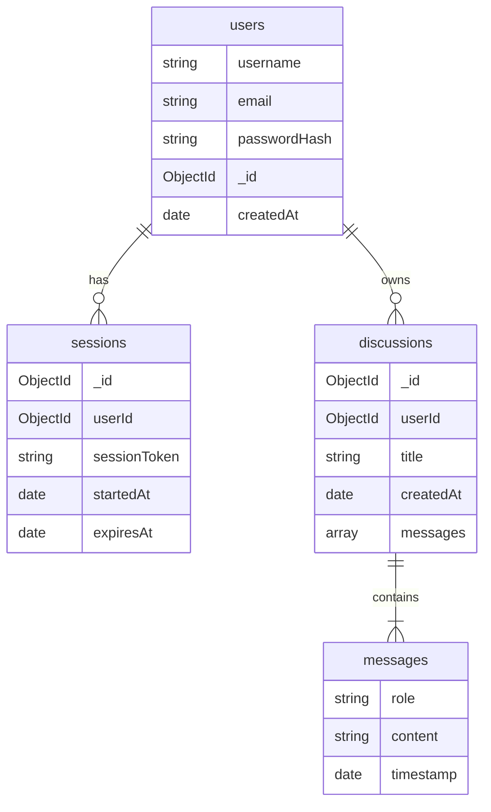

API : http://localhost:8000/
Swagger : http://localhost:8000/docs

```mermaid
erDiagram
    users {
        string username
        string email
        string passwordHash
        ObjectId _id
        date createdAt
    }

    sessions {
        ObjectId _id
        ObjectId userId
        string sessionToken
        date startedAt
        date expiresAt
    }

    discussions {
        ObjectId _id
        ObjectId userId
        string title
        date createdAt
        array messages
    }

    messages {
        string role
        string content
        date timestamp
    }

    users ||--o{ sessions : has
    users ||--o{ discussions : owns
    discussions ||--|{ messages : contains
```